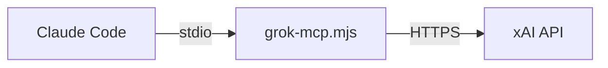

# Grok MCP Server

A [Model Context Protocol](https://modelcontextprotocol.io) (MCP) server that brings xAI's Grok API into [Claude Code](https://docs.anthropic.com/en/docs/claude-code) as native tools.

Ask Grok questions and generate images with Aurora -- directly from your terminal.

## Tools

| Tool | Description |
|------|-------------|
| `ask_grok` | Send a prompt to Grok and get a text response |
| `generate_image` | Generate images using Grok's Aurora model and save them locally |

## Prerequisites

- **Node.js** >= 18
- **Claude Code** CLI installed
- **xAI API key** -- get one at [console.x.ai](https://console.x.ai)

## Setup

### Option A: Install from npm

```bash
npm install -g askgrokmcp
```

Then register with Claude Code:

```bash
claude mcp add grok -e XAI_API_KEY=your_api_key_here -- grok-mcp
```

### Option B: Clone from source

```bash
git clone https://github.com/marceloceccon/askgrokmcp.git
cd askgrokmcp
npm install
```

Then register with Claude Code:

```bash
claude mcp add grok -e XAI_API_KEY=your_api_key_here -- node /path/to/askgrokmcp/grok-mcp.mjs
```

Replace `/path/to/askgrokmcp` with the actual path where you cloned the repository.

---

Replace `your_api_key_here` with your xAI API key in either option. That's it -- the tools are now available in Claude Code.

## Usage

Once registered, you can use the tools naturally in Claude Code:

### Ask Grok a question

```
> ask grok what the latest news in AI are
```

### Generate an image

```
> ask grok to generate an image of a sunset over mountains
```

### Generate multiple variations

```
> ask grok to generate 4 variations of a logo for a coffee shop and save them to /tmp/logo.png
```

When generating multiple images, files are automatically numbered (e.g., `logo-1.png`, `logo-2.png`, ...).

## Configuration

The server uses these xAI models by default:

| Purpose | Model |
|---------|-------|
| Chat | `grok-3-fast` |
| Image generation | `grok-imagine-image` |

To change models, edit the constants at the top of `grok-mcp.mjs`.

## How it works

This server implements the MCP protocol over stdio. When Claude Code starts, it launches the server as a subprocess and communicates with it via JSON-RPC over stdin/stdout. The server translates MCP tool calls into xAI API requests and returns the results.



## License

[MIT](LICENSE)
