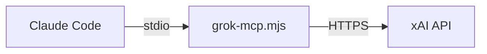

# Grok MCP Server

A [Model Context Protocol](https://modelcontextprotocol.io) (MCP) server that brings xAI's Grok API into [Claude Code](https://docs.anthropic.com/en/docs/claude-code) as native tools.

Ask Grok questions, generate images with Aurora, and explore available models — directly from your terminal.

## Tools

| Tool | Description |
|------|-------------|
| `ask_grok` | Send a prompt to Grok with optional system prompt and sampling parameters |
| `generate_image` | Generate images using Grok's Aurora model and save them locally |
| `list_models` | List all xAI models available to your account |

## Prerequisites

- **Node.js** >= 18
- **Claude Code** CLI installed
- **xAI API key** -- get one at [console.x.ai](https://console.x.ai)

## Setup

### Option A: Install from npm

```bash
npm install -g askgrokmcp
```

Then register with Claude Code:

```bash
claude mcp add grok -e XAI_API_KEY=your_api_key_here -- grok-mcp
```

### Option B: Clone from source

```bash
git clone https://github.com/marceloceccon/askgrokmcp.git
cd askgrokmcp
npm install
```

Then register with Claude Code:

```bash
claude mcp add grok -e XAI_API_KEY=your_api_key_here -- node /path/to/askgrokmcp/grok-mcp.mjs
```

Replace `/path/to/askgrokmcp` with the actual path where you cloned the repository.

---

Replace `your_api_key_here` with your xAI API key in either option. That's it -- the tools are now available in Claude Code.

## Usage

Once registered, you can use the tools naturally in Claude Code:

### Ask Grok a question

```
> ask grok what the latest news in AI are
```

### Use a system prompt

```
> ask grok to review this code, using a system prompt that says "You are a senior security auditor"
```

### Control sampling parameters

```
> ask grok to generate test data with temperature 0 and max_tokens 500
```

### Use a specific model for one call

```
> ask grok to summarize this document using grok-3
```

### Generate an image

```
> ask grok to generate an image of a sunset over mountains and save it as images/sunset.png
```

### Generate multiple variations

```
> ask grok to generate 4 variations of a logo for a coffee shop and save them as images/logo.png
```

When generating multiple images, files are automatically numbered (e.g., `logo-1.png`, `logo-2.png`, ...).

### List available models

```
> list the available grok models
> list grok chat models only
> list grok image models
```

## Model Selection

The server uses a three-level priority system for model selection:

| Priority | Mechanism | Scope |
|----------|-----------|-------|
| 1st (highest) | `model` argument in the tool call | Single request |
| 2nd | `GROK_CHAT_MODEL` / `GROK_IMAGE_MODEL` env vars | Server lifetime |
| 3rd (default) | Built-in defaults (see below) | Fallback |

### Built-in defaults

At startup the server probes the xAI `/models` endpoint and selects the best available model:

| Purpose | Frontier (preferred) | Fallback |
|---------|---------------------|----------|
| Chat | `grok-4.20-0309-reasoning` | `grok-3-fast` |
| Image generation | `grok-imagine-image-pro` | `grok-2-image` |

If the frontier model is not available on your account, the server automatically falls back to the safe default.

### Change defaults via environment variable

```bash
claude mcp add grok \
  -e XAI_API_KEY=your_api_key_here \
  -e GROK_CHAT_MODEL=grok-3 \
  -e GROK_IMAGE_MODEL=grok-2-image \
  -- grok-mcp
```

### Override per call

Just tell Claude which model to use:

```
> ask grok to explain quantum computing using model grok-3
```

Or use `list_models` first to discover what's available, then pick one.

## File write safety

By default the server only writes images inside the **current working directory** (the directory Claude Code was launched from) and its subdirectories. Any path that resolves outside that directory is rejected with a clear error.

To allow writes to a different location, set the `SAFE_WRITE_BASE_DIR` environment variable to an absolute path:

```bash
export SAFE_WRITE_BASE_DIR=/tmp/my-images
```

Or pass it directly when registering the server:

```bash
claude mcp add grok \
  -e XAI_API_KEY=your_api_key_here \
  -e SAFE_WRITE_BASE_DIR=/tmp/my-images \
  -- grok-mcp
```

> **Note:** Absolute paths that resolve outside the allowed base directory are rejected. Use relative paths (e.g. `images/output.png`) or set `SAFE_WRITE_BASE_DIR` explicitly.

## Configuration

| Variable | Default | Description |
|----------|---------|-------------|
| `XAI_API_KEY` | *(required)* | Your xAI API key |
| `GROK_CHAT_MODEL` | `grok-3-fast` | Default model for `ask_grok` |
| `GROK_IMAGE_MODEL` | `grok-2-image` | Default model for `generate_image` |
| `SAFE_WRITE_BASE_DIR` | `process.cwd()` | Base directory for image writes |
| `MAX_PROMPT_LENGTH` | `128000` | Maximum prompt length in characters (fail-fast guard) |
| `XAI_REQUEST_TIMEOUT_MS` | `30000` | Timeout per xAI API request in milliseconds |
| `XAI_MAX_RETRIES` | `2` | Number of retries for transient errors (429/5xx/network/timeout) |
| `XAI_RETRY_BASE_DELAY_MS` | `500` | Base delay for exponential retry backoff |
| `LOG_REQUESTS` | `false` | Logs tool/xAI request metadata to stderr |
| `LOG_REQUEST_PAYLOADS` | `false` | Includes full request payloads in logs (use carefully) |

## Request logging

Request logging is optional and disabled by default.

Enable metadata-only logs:

```bash
export LOG_REQUESTS=true
```

To also log full request payloads (including prompts), explicitly enable:

```bash
export LOG_REQUESTS=true
export LOG_REQUEST_PAYLOADS=true
```

> **Important:** Logs are written to stderr (not stdout) so MCP protocol communication remains safe.

## How it works

This server implements the MCP protocol over stdio. When Claude Code starts, it launches the server as a subprocess and communicates with it via JSON-RPC over stdin/stdout. The server translates MCP tool calls into xAI API requests and returns the results.



## License

[MIT](LICENSE)
